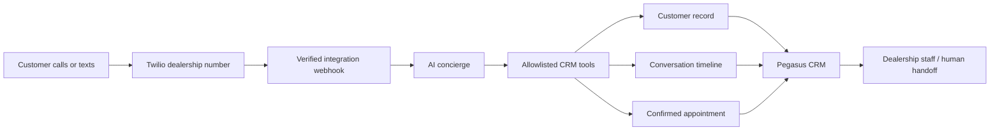

# Pegasus AI Dealership CRM

Pegasus is a legacy dealership CRM prototype built with TypeScript, Express, AdminJS, React, Mongoose, and MongoDB.

The product vision is an AI receptionist for automotive dealerships:

1. A customer calls or texts a dealership number.
2. Twilio receives the interaction.
3. An AI concierge answers questions and qualifies the lead.
4. The system creates or updates the customer record.
5. After the customer confirms a time, the system creates an appointment in the CRM.
6. Dealership staff can review the conversation, customer, appointment, and handoff status.

> **Prototype status:** the CRM application is present in this repository, but the historical AWS/Twilio/AI service is not. This project is not ready for production or real customer data.

## What is actually in this repository

The current code includes:

- AdminJS-based CRM administration
- Customers and leads
- Vehicle inventory
- Sales representatives
- Appointments
- Desk logs/deal tracking
- Blast/campaign records
- Dashboard components
- A finance calculator and other prototype UI surfaces
- A customer/bot conversation schema and read-only conversation view
- An outbound campaign call from the CRM to an external HTTP endpoint
- A safe local MongoDB launcher, demo customer, mock SMS endpoint, and smoke test

The current code does **not** include:

- A Twilio webhook handler
- Inbound SMS processing
- Voice or call handling
- An AI model integration
- Code that writes AI conversation turns
- AI-driven customer creation or appointment booking
- The source code for the historical AWS Lambda
- Delivery callbacks, signed webhook validation, opt-out processing, or human handoff

The word `bot` in the conversation model describes stored message data; it does not prove that an AI implementation exists in this repository.

## Intended product flow



The CRM should remain the system of record. A recovered or rebuilt AWS service should call authenticated, dealership-scoped CRM APIs rather than write directly to MongoDB.

## Legacy AWS and Twilio integration

The project owner has confirmed that Twilio handled SMS. Git history confirms that the CRM sent outbound JSON containing `phone` and `context` to AWS in `us-east-1`:

- The first implementation called an API Gateway route named `IncomingSMSHandler`.
- It was later changed to a direct Lambda Function URL.
- The URL was then moved into `AWS_SEND_MESSAGE_URI`.
- The request contained no AWS request signing or application authorization.
- The CRM marked a blast successful when the HTTP request succeeded, not when Twilio confirmed delivery.

No Lambda, Twilio SDK, AI SDK, infrastructure definition, inbound webhook, or voice implementation appears anywhere in the visible repository history. The external Lambda is therefore a legacy black box until its source and AWS configuration are recovered.

The fastest recovery path is:

1. Inspect the Twilio phone number configuration and record its inbound Messaging and Voice webhook URLs without changing them.
2. Inspect AWS in `us-east-1` for the corresponding API Gateway and Lambda resources.
3. Export the Lambda source, runtime, layers, aliases, event sources, environment-variable **names**, IAM policy summary, and CloudWatch log-group names.
4. Redact all secret values and customer data from recovery notes.
5. Identify the AI provider, voice provider, database access pattern, and appointment-writing behavior.
6. Choose whether to reuse, contain, or replace the legacy service only after that audit.

Do not invoke the historical endpoint, change a Twilio webhook, publish a Lambda version, or send a test message during discovery.

## Safe local development

The supported temporary local path uses an embedded persistent MongoDB instance and a loopback-only mock SMS receiver. It does not require MongoDB, Twilio, AWS, or AI API keys.

### Prerequisites

- Node.js and npm
- Internet access on the first run so the temporary Node 16 runtime and MongoDB binary can be downloaded

This legacy repository currently contains both `package-lock.json` and a Yarn v1 `yarn.lock`. The verified Windows-oriented local scripts use npm. Until a dedicated migration selects one package manager and removes the other, do not regenerate either lockfile independently.

Windows PowerShell:

```powershell
npm.cmd ci --legacy-peer-deps
```

macOS/Linux shell:

```bash
npm ci --legacy-peer-deps
```

`--legacy-peer-deps` is currently required because the application mixes Material UI v4 peer requirements with React 18-era types. Resolve that deliberately during dependency modernization rather than as an incidental setup change.

### Start the local application

Windows PowerShell:

```powershell
npm.cmd run dev:local
```

macOS/Linux shell:

```bash
npm run dev:local
```

The launcher:

- Builds the TypeScript application
- Starts MongoDB on `127.0.0.1:27343`
- Persists local data under `.local/mongodb`
- Seeds `demo.customer@example.com` when missing
- Starts a mock SMS endpoint on `127.0.0.1:3435`
- Overrides `AWS_SEND_MESSAGE_URI` so local campaign messages cannot reach the historical AWS endpoint
- Starts AdminJS at [http://127.0.0.1:3434/admin](http://127.0.0.1:3434/admin)

Stop the local stack with `Ctrl+C`.

### Run the smoke test

Keep the local application running and use a second terminal:

Windows PowerShell:

```powershell
npm.cmd run test:smoke
```

macOS/Linux shell:

```bash
npm run test:smoke
```

The smoke test verifies:

```text
AdminJS -> Express API -> MongoDB -> mock SMS
```

It checks the admin page, customer filtering, appointments, desk logs, conversations, campaign creation, and capture by the mock SMS service.

Each run creates a local `Blast` record. MongoDB data persists under `.local/mongodb`; captured mock inbox messages remain only in memory and disappear when the local launcher restarts.

### Inspect captured mock messages

While the local launcher is running:

```text
http://127.0.0.1:3435/messages
```

Only synthetic local data should be used.

## Runtime warning

The application is pinned to AdminJS 7.2 and cannot currently start on Node.js 24 because that AdminJS version uses obsolete JSON import-assertion syntax. The temporary `dev:local` command builds with the installed runtime and launches the compiled application under Node 16.

Node 16 is end-of-life and must not be used as the production solution. The MVP plan requires a controlled AdminJS/runtime migration followed by tests on a supported Node LTS release.

The following paths are legacy or currently unreliable and should not be used as evidence of production readiness:

- `npm run dev`
- `npm start` on Windows
- `npm run start:dev`
- The current Dockerfile and Compose configuration

## Configuration

Important current settings include:

| Variable | Purpose | Local behavior |
| --- | --- | --- |
| `NODE_ENV` | Runtime environment | Forced to `development` by `dev:local` |
| `PORT` | Express/AdminJS port | Defaults to `3434` |
| `MONGO_URL` | MongoDB connection | Set automatically by `dev:local` |
| `ADMIN_PASSWORD` | Seeded legacy admin password | Local launcher supplies a development-only value |
| `AWS_SEND_MESSAGE_URI` | Legacy outbound messaging endpoint | Always overridden with the loopback mock by `dev:local` |
| `MONGO_PORT` | Embedded local MongoDB port | Defaults to `27343` |
| `MOCK_SMS_PORT` | Local mock receiver port | Defaults to `3435` |
| `MONGOMS_VERSION` | Embedded MongoDB binary version | Defaults to `5.0.19` |

Do not place real credentials in `.env`, documentation, fixtures, issues, prompts, screenshots, or commits.

The current `.env-example` intentionally leaves the legacy endpoint blank. A live-looking historical Lambda URL remains in Git history; do not reuse it. The corresponding endpoint should be disabled or restricted if it still exists.

## Available commands

| Command | Current status |
| --- | --- |
| `npm run build` | Compiles TypeScript; currently passes on the installed Node runtime |
| `npm run dev:local` | Recommended temporary local path; starts persistent MongoDB, mock SMS, and the app |
| `npm run test:smoke` | Runs the local API/database/mock-SMS smoke test against an already running app |
| `npm run seed` | Legacy partial seed; not required for local smoke testing and not a migration |
| `npm run dev` | Legacy cross-platform issue; do not rely on it until repaired |
| `npm start` | Uses POSIX environment syntax and is not a valid Windows production command |
| `npm run server` | Legacy PM2 deployment path; production readiness has not been verified |

The current Docker and Compose files are also development-grade and unverified. They use an end-of-life Node image, unsafe/incorrect volume assumptions, an unpinned MongoDB image, and publicly mapped database/Redis ports.

## Security and data warnings

Before any internet-facing deployment:

- Rotate or revoke the historical MongoDB credential exposed in Git history.
- Treat the historical AWS endpoints as untrusted until ownership and authentication are verified.
- Rotate any Twilio, AI-provider, and database credentials stored in the old Lambda.
- Require authentication for both `/admin` and `/api` in every non-test environment.
- Replace hard-coded session and cookie secrets.
- Add dealership tenancy and prove isolation with two-dealership tests.
- Validate Twilio webhook signatures and reject replayed provider events.
- Add idempotency so retries cannot duplicate customers, messages, or appointments.
- Enforce consent, opt-out, quiet-hour, and campaign-limit rules.
- Add human handoff and deterministic provider/AI failure handling.
- Never give an AI model direct database access or trust model-generated IDs and fields without server validation.
- Obtain appropriate legal/compliance review before real calls or texts.

The current development mode bypasses AdminJS authentication, and current API routes are not protected. Do not expose the local application to a public network.

## MVP direction

The primary MVP acceptance flow is:

```text
mock/allowlisted inbound call or text
  -> verified Twilio event
  -> dealership mapping
  -> AI qualification
  -> customer upsert
  -> conversation persistence
  -> explicit appointment confirmation
  -> appointment in CRM
  -> staff review or human handoff
```

Every automated test must use deterministic mock Twilio and AI providers. Real credentials are only needed after the provider contract, tenant boundary, consent rules, staging environment, and safety gates are implemented.

See [MVP_IMPLEMENTATION_PLAN.md](./MVP_IMPLEMENTATION_PLAN.md) for the phased implementation plan and the copy/paste Claude kickoff prompt.

## Repository structure

```text
src/
  components/       AdminJS custom pages and dashboard UI
  core/database/    MongoDB connection and seed logic
  models/           Mongoose schemas
  resources/        AdminJS resource configuration
  routes/           Express API routes
  services/         Application/domain services
scripts/
  start-local.mjs   Local MongoDB + mock SMS launcher
  smoke-test.mjs    Local end-to-end smoke test
```

## Current development priorities

1. Preserve and document the working local baseline.
2. Recover and audit the historical Twilio/AWS integration without invoking it.
3. Rotate exposed or legacy credentials.
4. Move to a supported Node/AdminJS dependency set.
5. Add authenticated dealership tenancy to all APIs, AdminJS actions, and records.
6. Complete the customer, conversation, and appointment workflow.
7. Build the mock-first inbound AI concierge and human-handoff flow.
8. Connect one allowlisted Twilio number and approved AI provider in staging.
9. Modernize only the highest-use UI surfaces after the workflow and safety gates pass.

## Contributing safely

- Inspect `git status` and the complete diff before editing; the working tree may contain intentional uncommitted local-startup changes.
- Work one implementation-plan phase at a time.
- Add tests with behavior changes.
- Do not reset, discard, or overwrite unrelated work.
- Do not commit, push, deploy, create paid resources, send real messages, or modify production data without explicit approval.
- End each implementation slice with changed files, commands and results, migrations/configuration changes, remaining risks, and rollback instructions.
